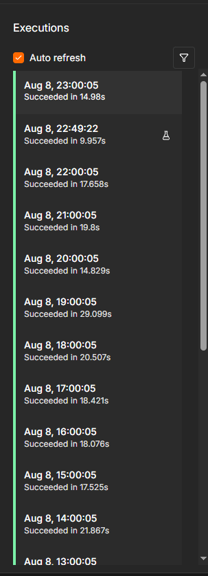

*[English](README.md) · **Español***

# Radar de empleo — cuatro fuentes ruidosas, un mensaje de Telegram

Un workflow de n8n que lee cuatro bolsas de empleo cada hora, descarta lo ya visto, puntúa lo que
queda contra un perfil usando un LLM, y avisa por Telegram solo de las que vale la pena abrir.

Lleva corriendo en mi propio servidor, cada hora, desde el 8 de agosto de 2026.

| Ejecuciones programadas | **26** |
| Fallos | **0** |
| Duración mediana | 18 s |
| Ejecución más rápida | **0.4 s** — no había nada nuevo, así que no se pagó ni una llamada al LLM |

Esa última fila es el diseño, no una curiosidad.



*La lista de ejecuciones del propio n8n. Once corridas seguidas, una por hora, todas en verde. La
de las 22:49 es manual —yo probando un cambio— y por eso rompe el patrón de arranques a
las :00:05.*

---

## La forma

```
Cada hora ─┬─ Bolsa de n8n (RSS)        ─→ quitar anuncios de freelancers ─┐
           ├─ Alertas de LinkedIn (Gmail) ─→ parsear los correos          ─┤
           ├─ We Work Remotely (RSS)    ─┬─→ filtro por palabras clave    ─┼─→ quitar las vistas
           └─ Get on Board (API REST)   ─┘                                 ┘
                                                                            │
                                     puntuar de 0 a 10 con un LLM ←─────────┘
                                                    │
                                           ≥ 6 → Telegram
```

---

## Las cuatro decisiones que lo mantienen vivo

**1. El filtro barato va antes que el caro.**
Las bolsas generalistas devuelven unas 200 ofertas por hora, casi todas de otros campos. Un
regex sobre el título las descarta gratis. Sin él, cada una de esas 200 costaría una llamada al
LLM y un tope mensual pequeño se agota en días. El regex es amplio a propósito: **descarta lo
obvio y deja que el modelo juzgue el resto.**

**2. Una fuente caída no puede tumbar la ejecución.**
Cada feed lleva `onError: continueRegularOutput` y dos reintentos. Si una fuente está caída, las
otros cuatro siguen entregando. La alternativa —un 503 que se lleva la hora entera— es la forma
en que los workflows programados dejan de funcionar sin que nadie se entere.

**3. La clave del dedupe es una URL limpia.**
Los correos de alerta de LinkedIn traen tokens de rastreo que cambian en cada envío. Deduplicar
con el enlace crudo haría que la misma oferta pareciera nueva cada hora, para siempre. El parser
recorta la URL a `/jobs/view/<id>` antes. **Un fallo sutil que se habría visto como si el modelo
se hubiera vuelto loco.**

**4. Un segundo modelo repara la salida del primero.**
La puntuación devuelve JSON estructurado con un output parser. Cuando el JSON viene mal formado,
un modelo reparador lo arregla en vez de que la ejecución muera. Y si la puntuación falla del
todo, la oferta **igual se envía**, sin puntaje. Perder una oferta real cuesta más que un aviso
ruidoso.

---

## Leer los correos de LinkedIn

La parte difícil no es la IA, es el parseo. Cada alerta trae varias ofertas separadas por una
línea de guiones, y dentro de cada bloque las líneas útiles van primero —título, empresa,
ubicación— seguidas de adornos que varían: *"3 connections"*, *"Actively recruiting"*,
*"Easy Apply"*.

Contar hacia atrás desde el enlace parece lo natural y corre el título una posición en cualquier
oferta que traiga un adorno. Por eso el parser **cuenta desde arriba**, después de filtrar una
lista conocida de ruido.

No raspa LinkedIn. Lee los correos de alerta que LinkedIn ya manda a tu propia bandeja.

---

## Cómo hacerlo tuyo

Importa `workflow.json` en n8n y cambia cuatro cosas, todas marcadas con `>>> REPLACE` en el
archivo:

1. **El perfil**, en el mensaje de sistema de *Score the job*. Es el motor entero — sé concreto.
   Nombra las herramientas, el sector y la seniority que de verdad tienes. Un perfil vago produce
   puntajes vagos.
2. **El filtro de palabras clave**, en *In my lane only*. Las palabras de tu campo.
3. **Los términos de búsqueda**, en *What to search*. Cinco consultas para la bolsa de LatAm.
4. **Tu chat ID de Telegram**, en *Tell me on Telegram*.

Credenciales necesarias: Gmail (basta con lectura), un bot de Telegram y una llave de Anthropic.
Pon un **tope de gasto en la cuenta del modelo antes de conectarla** — un workflow que corre cada
hora con un LLM dentro es una suscripción que no querías contratar.

### La regla que vale la pena robarse

El prompt de puntuación tiene una regla que manda sobre todas: **¿pueden contratar de verdad a
esta persona?** No de qué país es la empresa, sino dónde puede vivir quien ocupe el puesto.

Una oferta que dice "Remote" y después "from Portugal" es remota *y* te excluye. El prompt le
pone tope de 4 sobre 10 por bien que encaje el resto, porque un puesto que no puede contratarte
no vale tu tiempo aunque describa tu carrera entera.

Esa sola regla quitó la mayoría de los falsos positivos.

---

### El campo que miente

We Work Remotely publica un campo `region`. De 100 ofertas medidas el 8 de agosto de 2026, **90
decían "Anywhere in the World"** — y **15 de esas 90 escondían una restricción real en el cuerpo
del anuncio**: *"open to candidates located in British Columbia or Ontario"*, *"located in the
Mission District of San Francisco"*, *"authorized to work in the United States"*.

Uno de cada seis. Por eso el prompt no recibe el campo de región y ya: recibe los primeros 1.500
caracteres del texto del anuncio. **El metadato que publica la empresa es una intención; la
restricción vive en la letra pequeña.**

Vale la pena decirlo al revés: escribí un script para auditar este workflow usando el campo
`region`, y el script se equivocó donde el workflow acertaba.

---

## Lo que no hace

- **No se postula por ti.** Decide qué merece tu atención; el mensaje lo escribes tú.
- **No raspa sitios que lo prohíben.** Cuatro RSS, una API pública y tu propia bandeja de entrada.
- **No aprende.** Los puntajes salen de un prompt fijo. Mejorarlo es editar el perfil, no
  entrenar nada.
- **Los puntajes no están validados contra resultados.** Sé que dispara y sé que no me inunda —
  no tengo datos de si un 9/10 convierte mejor que un 7/10. Afirmarlo exigiría una muestra que
  todavía no tengo.

---

## Archivos

```
workflow.json                    Se importa directo en n8n. Sin credenciales ni datos personales.
code/parse-linkedin-alerts.js    El parser de correos que se explica arriba.
code/normalize-getonboard.js     Lleva la API REST a los mismos campos que emiten los RSS.
code/latam-search-terms.js       Las cinco consultas, y por qué esas cinco.
LICENSE                          MIT.
```

Los tres archivos de `code/` son el JavaScript que vive dentro de los nodos Code del workflow,
sacado aparte para poder leerlo en GitHub. La fuente sigue siendo `workflow.json`: los extractos
existen porque un JSON de 23 KB con el código escapado con `
` no lo revisa nadie.

Construido y corriendo en un n8n autoalojado — el mismo servidor que describe
[servidor-n8n-autoalojado](https://github.com/andresjmnz92-jpg/servidor-n8n-autoalojado).
