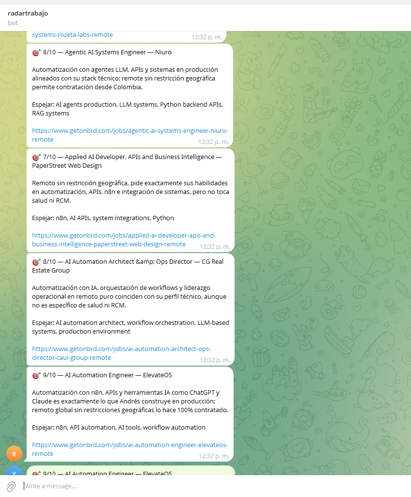

***English** · [Español](README.es.md)*

# Job Radar — four noisy sources, one Telegram message

An n8n workflow that reads four job boards every hour, throws away everything already seen,
scores what's left against a profile using an LLM, and pings Telegram only for the ones worth
opening.

It has been running on my own server, once an hour, since 2026-08-08 — a single day at the time
of writing, which is what the numbers below cover.

| Scheduled runs | **26** |
| Failures | **0** |
| Median duration | 18 s |
| Fastest run | **0.4 s** — nothing new, so not a single LLM call was paid for |

That last row is the design, not a curiosity.


*n8n's own execution list. Eleven consecutive hourly runs, every one green. The 22:49 entry is a
manual run — me testing a change — which is why it breaks the pattern of :00:05 starts.*

---

## The shape

```
Every hour ─┬─ n8n job board (RSS)      ─→ drop freelancer ads ─┐
            ├─ LinkedIn alerts (Gmail)  ─→ parse the emails    ─┤
            ├─ We Work Remotely (RSS)   ─┬─→ keyword filter    ─┼─→ drop already seen
            └─ Get on Board (REST API)  ─┘                      ┘
                                                                 │
                                     score 0-10 with an LLM ←────┘
                                                 │
                                        ≥ 6 → Telegram
```

### What arrives



Real alerts, not a mockup. Each one carries the score, a one-line reason, the terms worth
mirroring in the CV, and the link. The reasons come back in Spanish because the prompt is written
in Spanish; the postings are read in English.

**Four lines is the whole product.** Everything upstream exists so that this arrives a handful of
times a day instead of two hundred.

**Two defects are visible in that screenshot, and I am leaving them there.** The `&` in
*"Architect &amp; Ops Director"* is escaped twice — the source already delivers `&amp;` and the
workflow escapes it again. And ElevateOS arrives twice, so the dedupe is being beaten by two
sources publishing the same job under different URLs. Both are open, both are listed below.

---

## The four decisions that make it survive

**1. The cheap filter runs before the expensive one.**
General boards return ~200 jobs an hour, nearly all from unrelated fields. A regex over the
title drops them for free. Without it, every one of those 200 would cost an LLM call and a small
monthly budget would be gone in days. The regex is deliberately broad: **it discards the obvious
and lets the model judge the rest.**

**2. A dead source cannot kill the run.**
Every feed carries `onError: continueRegularOutput` and two retries. If one feed is down, the
others still deliver. The alternative — one 503 wiping out the hour — is how scheduled
workflows quietly stop working without anyone noticing.

**3. The dedupe key is a cleaned URL.**
LinkedIn's alert emails carry tracking tokens that change in every send. Deduping on the raw
link would treat the same job as new every hour, forever. The parser strips the URL down to
`/jobs/view/<id>` first. **A subtle bug that would have looked like the model going crazy.**

**4. A second model repairs the first one's output.**
Scoring returns structured JSON through an output parser. When the JSON comes back malformed,
a repair model fixes it instead of the run dying. And if scoring fails entirely, the job is
**still** sent — without a score. Losing a real opening costs more than a noisy alert.

---

## Reading the LinkedIn emails

The trickiest part isn't the AI, it's the parsing. Each alert holds several jobs separated by a
line of dashes, and inside each block the useful lines come first — title, company, location —
followed by decorations that vary: *"3 connections"*, *"Actively recruiting"*, *"Easy Apply"*.

Counting backwards from the link looks natural and shifts the title by one on any post that has
a decoration. So the parser **counts from the top**, after filtering a known noise list.

It does not scrape LinkedIn. It reads the alert emails LinkedIn already sends to your own inbox.

---

## Making it yours

Import `workflow.json` into n8n and change four things, all marked `>>> REPLACE` in the file:

1. **The profile**, in the system message of *Score the job*. This is the whole engine — be
   specific. Name the tools, the industry and the seniority you actually have. A vague profile
   produces vague scores.
2. **The keyword filter**, in *In my lane only*. The words of your field.
3. **The search terms**, in *What to search*. Five queries for the LatAm board.
4. **Your Telegram chat ID**, in *Tell me on Telegram*.

Credentials needed: Gmail (read-only is enough), Telegram bot, and an Anthropic key. Set a
**spending cap on the model account before connecting it** — an hourly workflow with an LLM in
the loop is a subscription you did not intend to buy.

### The rule worth stealing

The scoring prompt has one rule that overrides all others: **can they actually hire this
person?** Not what country the company is in — where the person in the role is allowed to live.

A posting that says "Remote" and then "from Portugal" is remote *and* excludes you. The prompt
caps those at 4 out of 10 no matter how well the rest fits, because a job that cannot hire you
is not worth your time even when it describes your entire career.

Read that cap together with the threshold in the diagram: **4 is below 6, so a geographically
blocked posting can never reach the phone.** That is the point of setting a ceiling rather than
subtracting points — no amount of fit buys its way past it.

In practice the model is harsher than the rule. Across a full day of runs, every blocked posting
came back at **0, not 4** — including three that were my exact field (revenue cycle, claims, Epic)
and lost on country alone. The cap is a ceiling the model never uses; it decides these are worth
zero, and it is not wrong.

That single rule removed most of the false positives.

---

### The field that lies

We Work Remotely publishes a `region` field. Of 100 postings measured on 2026-08-08, **90 said
"Anywhere in the World"** — and **15 of those 90 hid a real restriction in the body**: *"open to
candidates located in British Columbia or Ontario"*, *"located in the Mission District of San
Francisco"*, *"authorized to work in the United States"*.

One in six. That is why the prompt does not get the region field on its own: it gets the first
1,500 characters of the posting text. **The metadata a company publishes is an intention; the
restriction lives in the fine print.**

Worth saying the other way round: I wrote a script to audit this workflow using the `region`
field, and the script was wrong where the workflow was right.

---

## What it doesn't do

- **It doesn't apply for you.** It decides what deserves your attention; you write the message.
- **It doesn't scrape sites that forbid it.** Four RSS feeds, one public API, and your own inbox.
- **It doesn't learn.** Scores come from a static prompt. Improving it means editing the profile,
  not training anything.
- **The scores have not been validated against outcomes.** I know it fires and I know it's not
  flooding me — I do not have data on whether a 9/10 converts better than a 7/10. Claiming that
  would need a sample I don't have yet.

### Open, and worse than they look

- **Ampersands are escaped twice.** Decision 4 above escapes the assembled message once, which
  fixed escaping field by field. It did not account for sources that deliver `&amp;` already
  encoded. The visible cost is a wrong character; the real cost is that Telegram answers
  `Bad request - please check your parameters` and the run dies mid-batch — and the dedupe has
  already marked those postings as seen, so they are never retried. **A cosmetic bug and a
  silent data-loss bug are the same bug here.**
- **Deduping on the URL misses cross-source duplicates.** The same job published on two boards
  has two URLs, so it arrives twice. Deduping on a normalized title plus company would catch it,
  at the risk of collapsing genuinely different postings from the same employer.

---

## Files

```
workflow.json                    Import straight into n8n. No credentials, no personal data.
code/parse-linkedin-alerts.js    The email parser described above.
code/normalize-getonboard.js     Maps the REST API onto the fields the RSS sources emit.
code/latam-search-terms.js       The five queries, and why these five.
LICENSE                          MIT.
```

The three files under `code/` are the JavaScript that lives inside the workflow's Code nodes,
pulled out so it can be read on GitHub. `workflow.json` remains the source of truth — the
extracts exist because nobody reviews a 23 KB JSON whose code sits on one line with the
newlines escaped.

Built and run on a self-hosted n8n — the same server described in
[servidor-n8n-autoalojado](https://github.com/andresjmnz92-jpg/servidor-n8n-autoalojado).
